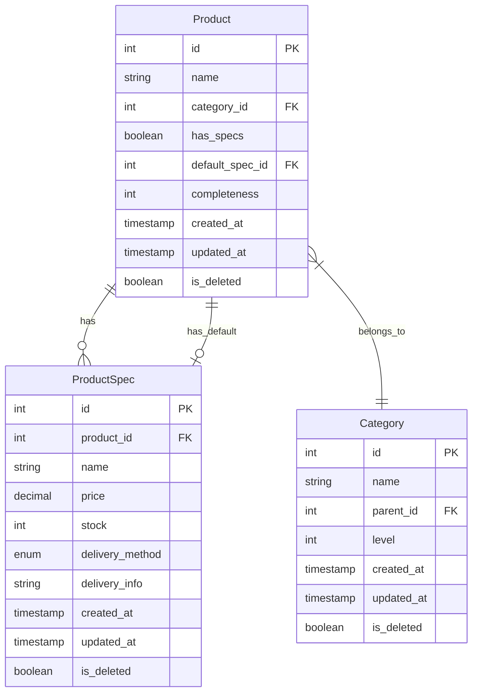

# 商品管理系统数据库设计文档

## 业务逻辑关系说明

### 商品与分类关系
1. 每个商品必须属于一个分类
2. 分类目前采用一级分类结构，包括：学习资料、日剧、美剧、漫画、韩剧、国内电视剧、动漫、电子书、电影
3. 分类在前端页面通过分类选择器进行管理，支持添加和删除操作

### 商品规格逻辑
1. 商品支持单规格和多规格两种模式：
   - 单规格模式：只有一种发货方式
   - 多规格模式：支持多种发货方式（如百度网盘+夸克网盘）
2. 多规格模式特点：
   - 切换到多规格模式时会自动创建一个默认规格
   - 同一商品的不同规格价格可以相同也可以不同
   - 每个规格都是完整的商品内容，只是发货方式不同

### 发货方式管理
1. 系统支持五种标准发货方式：
   - 百度网盘链接
   - 百度网盘群链接
   - 百度网盘群口令
   - 夸克网盘链接
   - 夸克网盘群链接
2. 每个规格必须选择一种发货方式
3. 发货方式在前端通过标准选项进行选择

### 商品完整度计算
1. 完整度是商品信息填写的完整程度（0-100%）
2. 计算规则：
   - 基础信息：商品名称、分类
   - 销售信息：价格、库存、发货方式、发货信息
3. 完整度显示：
   - 在商品列表中显示进度条
   - 进度条颜色反映完整度状态
   - 鼠标悬停显示未填写的字段

### 前端页面交互
1. 商品表单：
   - 分为基础信息和销售信息两部分
   - 动态显示单规格/多规格表单
   - 实时计算和显示完整度
2. 商品列表：
   - 显示商品基本信息
   - 展示完整度进度条
   - 支持编辑和删除操作
3. 发货方式设置：
   - 通过标准选项选择发货方式
   - 根据选择的方式显示对应的信息输入框

## 实体关系图



## 表结构详细说明

### Product (商品表)

| 字段名 | 类型 | 是否必填 | 说明 |
|--------|------|----------|------|
| id | int | 是 | 主键,自增 |
| name | varchar(100) | 是 | 商品名称 |
| category_id | int | 是 | 分类ID,关联Category表 |
| has_specs | boolean | 是 | 是否启用多规格 |
| default_spec_id | int | 否 | 默认规格ID,关联ProductSpec表 |
| completeness | int | 是 | 商品信息完整度(0-100) |
| created_at | timestamp | 是 | 创建时间 |
| updated_at | timestamp | 是 | 更新时间 |
| is_deleted | boolean | 是 | 是否删除 |

### ProductSpec (商品规格表)

| 字段名 | 类型 | 是否必填 | 说明 |
|--------|------|----------|------|
| id | int | 是 | 主键,自增 |
| product_id | int | 是 | 商品ID,关联Product表 |
| name | varchar(50) | 是 | 规格名称 |
| price | decimal(10,2) | 是 | 价格 |
| stock | int | 是 | 库存数量 |
| delivery_method | enum | 是 | 发货方式,见下方说明 |
| delivery_info | varchar(200) | 是 | 发货相关信息 |
| created_at | timestamp | 是 | 创建时间 |
| updated_at | timestamp | 是 | 更新时间 |
| is_deleted | boolean | 是 | 是否删除 |

### Category (分类表)

| 字段名 | 类型 | 是否必填 | 说明 |
|--------|------|----------|------|
| id | int | 是 | 主键,自增 |
| name | varchar(50) | 是 | 分类名称 |
| parent_id | int | 否 | 父分类ID,关联本表 |
| level | int | 是 | 分类层级(1-一级分类,2-二级分类) |
| created_at | timestamp | 是 | 创建时间 |
| updated_at | timestamp | 是 | 更新时间 |
| is_deleted | boolean | 是 | 是否删除 |

## 关键说明

1. 所有表都使用软删除(is_deleted)和时间戳字段
2. Product表新增字段说明:
   - default_spec_id: 多规格模式下的默认规格
   - completeness: 根据已填写字段计算的完整度
3. delivery_method字段为枚举类型:
   ```sql
   CREATE TYPE delivery_method_enum AS ENUM (
     'BAIDU_LINK',        -- 百度网盘链接
     'BAIDU_GROUP_LINK',  -- 百度网盘群链接
     'BAIDU_GROUP_CODE',  -- 百度网盘群口令
     'QUARK_LINK',        -- 夸克网盘链接
     'QUARK_GROUP_LINK'   -- 夸克网盘群链接
   );
   ```

## 示例数据

### Category表示例
```sql
INSERT INTO category (name, parent_id, level) VALUES
('学习资料', NULL, 1),  -- id: 1
('日剧', NULL, 1),      -- id: 2
('美剧', NULL, 1),      -- id: 3
('漫画', NULL, 1),      -- id: 4
('韩剧', NULL, 1),      -- id: 5
('国内电视剧', NULL, 1), -- id: 6
('动漫', NULL, 1),      -- id: 7
('电子书', NULL, 1),    -- id: 8
('电影', NULL, 1);      -- id: 9
```

### Product表示例
```sql
-- 美剧示例（多规格 - 不同发货方式）
INSERT INTO product (name, category_id, has_specs, completeness) VALUES
('绝命毒师全集 4K', 3, true, 100);  -- id: 1

-- 电子书示例（单规格）
INSERT INTO product (name, category_id, has_specs, completeness) VALUES
('深入理解计算机系统', 8, false, 100);  -- id: 2

-- 学习资料示例（多规格 - 不同发货方式）
INSERT INTO product (name, category_id, has_specs, completeness) VALUES
('Python零基础到进阶课程', 1, true, 100);  -- id: 3
```

### ProductSpec表示例
```sql
-- 绝命毒师全集的不同发货方式
INSERT INTO product_spec (product_id, name, price, stock, delivery_method, delivery_info) VALUES
(1, '百度网盘发货', 129.99, 999, 'BAIDU_LINK', 'https://pan.baidu.com/s/xxx'),
(1, '百度网盘群组', 129.99, 999, 'BAIDU_GROUP_LINK', '加入群组获取：https://pan.baidu.com/s/xxx'),
(1, '夸克网盘发货', 129.99, 999, 'QUARK_LINK', 'https://pan.quark.cn/s/xxx');

-- 深入理解计算机系统（单一发货方式）
INSERT INTO product_spec (product_id, name, price, stock, delivery_method, delivery_info) VALUES
(2, '默认发货方式', 49.99, 999, 'BAIDU_LINK', 'https://pan.baidu.com/s/xxx');

-- Python课程的不同发货方式
INSERT INTO product_spec (product_id, name, price, stock, delivery_method, delivery_info) VALUES
(3, '百度网盘直接发货', 299.99, 999, 'BAIDU_LINK', 'https://pan.baidu.com/s/xxx'),
(3, '百度网盘群发货', 299.99, 999, 'BAIDU_GROUP_CODE', '加群获取提取码：PYTHON888'),
(3, '夸克网盘群发货', 299.99, 999, 'QUARK_GROUP_LINK', 'https://pan.quark.cn/s/xxx');

-- 设置默认规格
UPDATE product SET default_spec_id = 1 WHERE id = 1;   -- 绝命毒师默认百度网盘发货
UPDATE product SET default_spec_id = 4 WHERE id = 2;   -- 计算机系统书默认发货方式
UPDATE product SET default_spec_id = 5 WHERE id = 3;   -- Python课程默认百度网盘直接发货
```
``` 