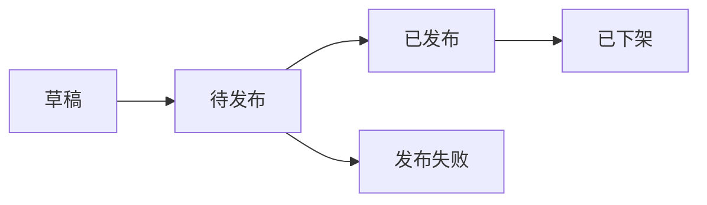

# 数据库设计文档

## 版本
v0.2.8

## 更新历史

### v0.2.8 (2024-12-21)
- 优化商品数据结构
  - 添加批量操作支持
  - 完善日期筛选机制
  - 优化状态显示逻辑
- 改进数据管理
  - 优化数据过滤机制
  - 完善批量操作处理
  - 改进数据展示格式

### v0.2.3 (2024-12-16)
- 优化选品数据结构
  - 添加commonImages字段，用于存储公共图片信息
  - 完善图片数据的存储格式
  - 优化图片排序和管理机制
- 改进数据完整度计算
  - 将公共图片纳入完整度计算
  - 优化完整度检查机制
  - 完善数据验证规则

### v0.2.2 (2024-12-14)
- 优化选品数据结构
  - 添加lastUpdated字段，用于记录最后更新时间
  - 添加distributedAt字段，用于记录分配时间
  - 完善选品状态管理
- 改进数据同步机制
  - 优化选品和商品的关联关系
  - 完善数据一致性保证
  - 改进状态变更追踪

## 选品状态说明

### 新建选品页状态
- manual: 手动创建
- crawler_pending: 待爬虫
- crawler_running: 爬虫进行中
- crawler_success: 爬虫成功
- crawler_failed: 爬虫失败
- inactive: 已下架

### 选品管理页状态
- pending: 待分配
- distributed: 已分配
- inactive: 已下架

### 状态流转说明
1. 手动创建流程：
   - manual -> pending -> distributed
2. 爬虫创建流程：
   - crawler_pending -> crawler_running -> crawler_success/crawler_failed
   - crawler_success -> pending -> distributed
3. 下架操作：
   - 任意状态 -> inactive

## 数据结构

### 选品表 (selections)
| 字段名 | 类型 | 必填 | 描述 |
|-------|------|-----|------|
| id | string | 是 | 选品ID |
| name | string | 是 | 选品名称 |
| category | string | 否 | 选品分类 |
| description | string | 否 | 选品描述 |
| price | number | 是 | 选品价格 |
| stock | number | 是 | 选品库存 |
| status | enum | 是 | 选品状态(pending/distributed) |
| source | enum | ��� | 创建方式(manual/crawler) |
| hasSpecs | boolean | 是 | 是否有多规格 |
| saleInfo | object | 否 | 销售信息(单规格) |
| specs | array | 否 | 规格信息(多规格) |
| createdAt | datetime | 是 | 创建时间 |

### 商品表 (products)
| 字段名 | 类型 | 必填 | 描述 |
|-------|------|-----|------|
| id | string | 是 | 商品ID |
| selectionId | string | 是 | 关联的选品ID |
| storeId | string | 是 | 关联的店铺ID |
| templateId | string | 是 | 使用的模板ID |
| name | string | 是 | 商品名称 |
| category | string | 否 | 商品分类 |
| description | string | 否 | 商品描述 |
| price | number | 是 | 商品价格 |
| stock | number | 是 | 商品库存 |
| status | enum | 是 | 商品状态(draft/pending/published/failed/offline) |
| distributedTitle | string | 是 | 模板渲染后的标题 |
| distributedContent | string | 是 | 模板渲染后的文案 |
| distributedAt | datetime | 是 | 分配时间 |
| publishedAt | datetime | 否 | 发布时间 |
| lastUpdated | datetime | 是 | 最后更新时间 |

### 店铺表 (stores)
| 字段名 | 类型 | 必填 | 描述 |
|-------|------|-----|------|
| id | string | 是 | 店铺ID |
| name | string | 是 | 店铺名称 |
| platform | string | 是 | 平台类型 |
| features | object | 是 | 店铺功能配置 |
| templates | array | 否 | 店铺模板列表 |
| status | enum | 是 | 店铺状态 |

### 店铺组表 (store_groups)
| 字段名 | 类型 | 必填 | 描述 |
|-------|------|-----|------|
| id | string | 是 | 店铺组ID |
| name | string | 是 | 店铺组名称 |
| storeIds | array | 是 | 包含的店铺ID列表 |

## 状态流转

### 选品状态流转


### 商品状态流转


## 数据关系
- 一个选品可以分配到多个店铺，生成多个商品记录
- 每个商品记录关联一个选品和一个店铺
- 每个店铺可以属于多个店铺组
- 每个店铺有自己的模板配置
``` 